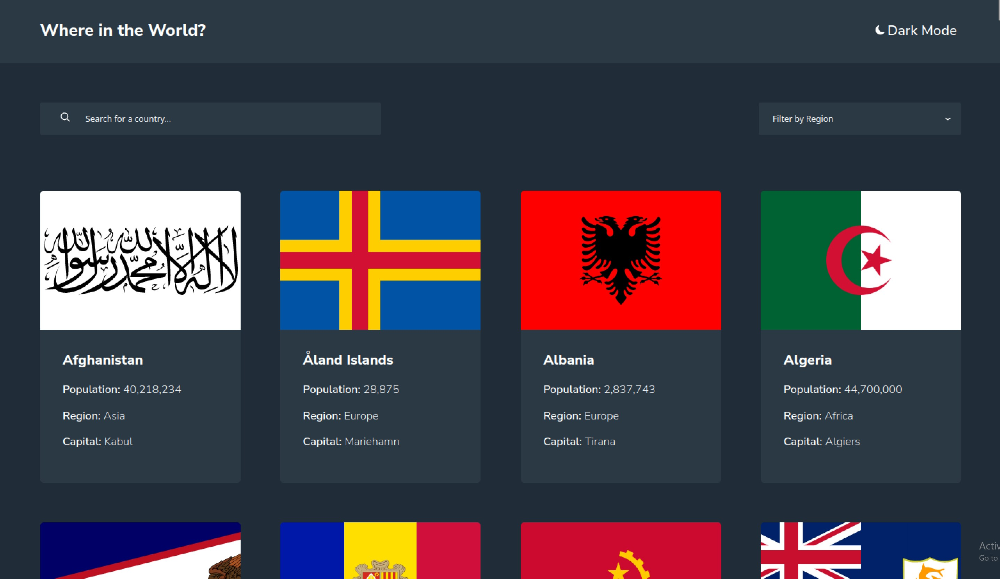
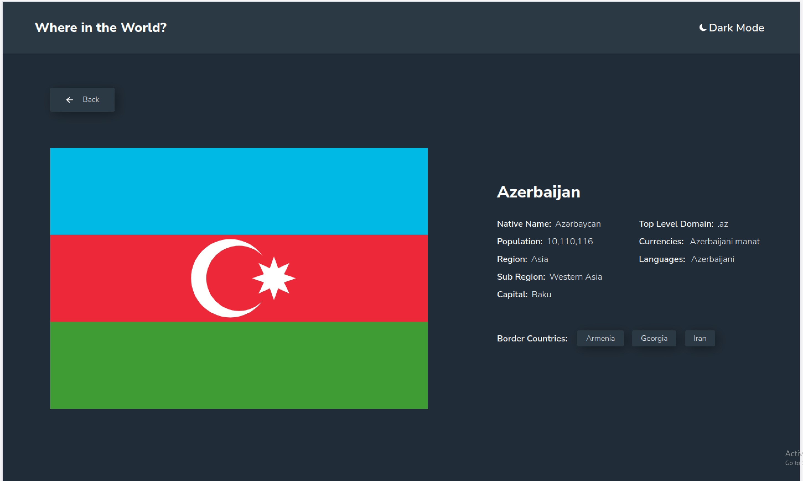
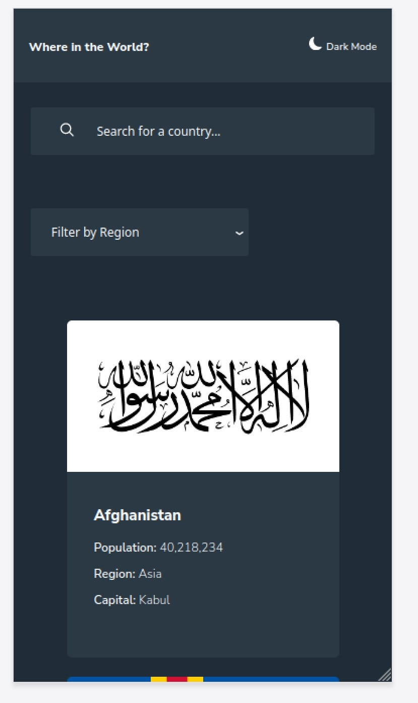
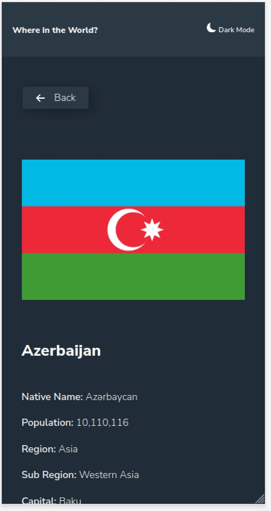
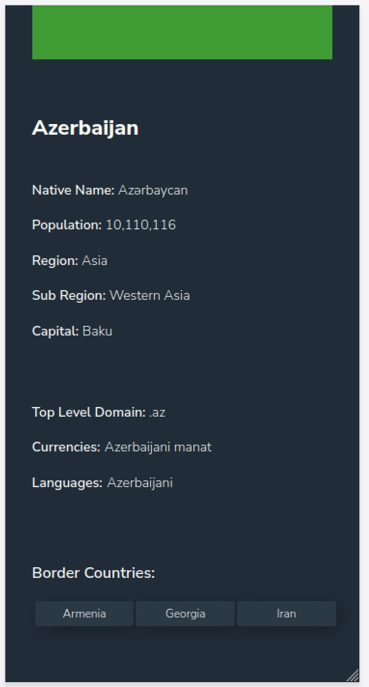

# fm-countries-challenge

This is a front-end coding challenge to integrate the REST countries API with a color scheme switcher

### The challenge

Users should be able to:

- See all countries from the API on the homepage
- Search for a country using an `input` field
- Filter countries by region
- Click on a country to see more detailed information on a separate page
- Click through to the border countries on the detail page
- Toggle the color scheme between light and dark mode

### Screenshots














### Links

- Live Website Preview - [Live Demo](https://fm-countries-challenge.vercel.app)

## My process

### Built with

- Semantic HTML5 markup
- CSS custom properties
- Flexbox
- CSS Grid
- [React](https://reactjs.org/) - JS library
- [Next.js](https://nextjs.org/) - React framework
- [TypeScript](https://www.typescriptlang.org/) - For JS typing, tooling
- [SCSS](https://sass-lang.com/) - For styles
- [Jest](https://jestjs.io/) - For unit tests
- [Playwright](https://playwright.dev/) - For end-to-end test

### What I learned

Typing, and generally working with TypeScript along with Next.JS and React.

```js
type ButtonProps = {
  buttonprops: {
    title: string,
    tooltip?: string,
    text?: string,
  },
  onClick?: () => void,
};
```

For the e2e tests I tried to focus on how users would ultimately use the app. Now that I have more experience with Jest and Playwright I’d like to put Test Driven Development into practice for my next project.

```js
test("country page - home to country page and back", async ({ page, port }) => {
  await page.goto(`http://localhost:${port}/`);

  const navigationPromise1 = page.waitForNavigation();

  await page.locator("figure", { hasText: "Algeria" }).click();

  await navigationPromise1;

  const countryname = await page.locator("h2");

  await expect(countryname).toContainText("Algeria");

  const navigationPromise2 = page.waitForNavigation();

  await page.locator("button", { hasText: "Back" }).click();

  await navigationPromise2;

  const textinput = await page.getByTitle("Search for a country");

  await expect(textinput).toHaveAttribute("value", "");
});
```

Creating a CI/CD pipeline using GitHub actions is really straightforward! I referenced [Jarrod Watts's blog post](https://blog.jarrodwatts.com/how-to-set-up-nextjs-with-jest-react-testing-library-and-playwright) for the base .yml though I did need to update the node version used to 18.xx and specify the setup-node version to v3.

Additionally I came across some great solutions for accessible focus & hover state indicator stylings. I’d recommend [this article from Prismic on CSS accessibility](https://prismic.io/blog/nextjs-accessibility#css-accessibility).

```css
&:hover {
  transform: scale(1.05);
  cursor: pointer;
}

&:focus {
  outline: 0.1em var(--color-focus-indicator) solid;
  outline-offset: 0.1rem;
}

&:focus:not(:focus-visible) {
  /* when not in focus - undo focus styles*/
  outline: 0;
  outline-offset: 0.25rem;
}

&:focus-visible {
  /* keyboard navigators */
  outline: 0.25em var(--color-focus-indicator) dashed;
  outline-offset: 0.25rem;
}
```

The color theme switcher solution I came across was easy to build and understand! With the right planning it was one of the easiest features to implement for the project and maintain without breaking. [Here’s a link to a theme toggle for Next.js from Rob Morieson](https://electricanimals.com/articles/next-js-dark-mode-toggle).

For the [country].ts page I defined different data requests within the getServerSideProps in order to retrieve all of the relevant data needed for the page. Information on the bordering countries required making a request to the updated API endpoint, and there were a few country names that required string manipulation in order to match the corresponding url param.

### Continued development

- Continue working with TypeScript!
- Improving SCSS styling, layout techniques.
- Test-Driven-Development & e2e testing.
- Mobile first design. Media queries and CSS seem to come out a lot better and more manageable with this approach.
- Choosing responsive units. I found situations where vh was not the best choice compared to using a % for some components.

### Useful resources

- [Dark / Light Theme Toggle for NextJS](https://electricanimals.com/articles/next-js-dark-mode-toggle) Great instructions on how to get a theme switch going. Implementation is simple enough to maintain throughout a project.
- [Typing with React components](https://www.thisdot.co/blog/composing-react-components-with-typescript) Nice examples!
- [Focus and hover state stylings](https://prismic.io/blog/nextjs-accessibility#css-accessibility) Very useful and easy to include!
- [Focus indicators](https://www.sarasoueidan.com/blog/focus-indicators/) More information on focus indicators and accessibility!
- [Jest, Playwright, CI/CD pipeline](https://blog.jarrodwatts.com/how-to-set-up-nextjs-with-jest-react-testing-library-and-playwright) Extremely useful for getting tests setup with NextJS. You might need to update the Node version used with the GitHub Actions set up.
- [Playwright Setup](https://frontend-digest.com/using-playwright-to-test-next-js-applications-80a767540091) The compliment to Jarrod Watts's blog! Highly recommended if you are looking for details on using Playwirght with NextJS.

## Author

- Instagram - [@Gomurmamma](https://www.instagram.com/Gomurmamma)
- GitHub - [@Gomurmamma](https://www.github.com/profile/Gomurmamma)
